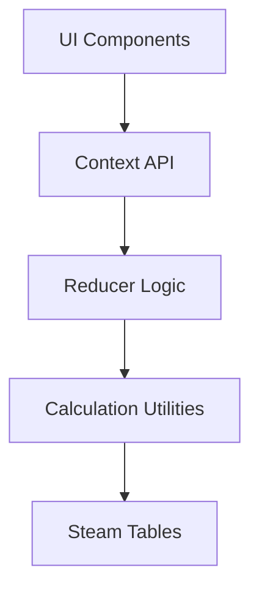
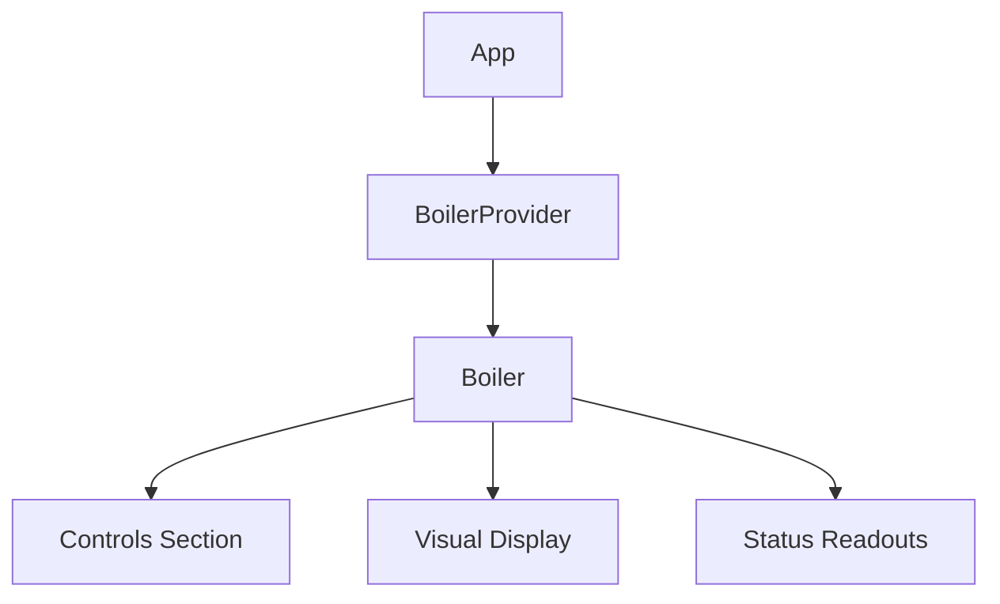
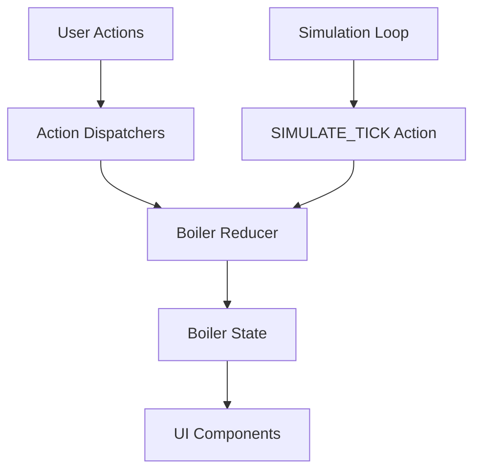

# System Patterns

## Architecture Overview

The Steam Boiler Simulation is built using a React application with a clear separation of concerns. The architecture follows these key patterns:



## Core Design Patterns

### Context-Reducer Pattern

The application uses React's Context API combined with the Reducer pattern to manage state and simulation logic:

1. **BoilerContext**: Provides the state and action dispatchers to components
2. **BoilerReducer**: Contains the core simulation logic and state transitions
3. **BoilerProvider**: Sets up the simulation loop and connects the reducer to the context

This pattern offers several benefits:
- Centralized state management
- Clear separation between UI and simulation logic
- Predictable state transitions through actions
- Easy access to state from any component in the tree

### Simulation Loop

The simulation uses a time-based loop implemented with `useEffect` and `setInterval`:

```javascript
useEffect(() => {
  let lastTime = Date.now()

  const simulationInterval = setInterval(() => {
    const now = Date.now()
    const deltaTime = (now - lastTime) / 1000 // Convert to seconds
    lastTime = now

    dispatch({ type: "SIMULATE_TICK", deltaTime })
  }, 100) // Update 10 times per second

  return () => {
    clearInterval(simulationInterval)
  }
}, [])
```

This pattern:
- Ensures consistent simulation updates (10 times per second)
- Accounts for actual elapsed time between updates
- Properly cleans up when the component unmounts

### Energy Balance Approach

The simulation uses an energy balance approach to model the thermodynamic system:

```
Energy Change = Energy Input (gas) - Energy Output (cooling, steam generation, draining)
```

This pattern:
- Ensures conservation of energy in the system
- Provides a physically accurate basis for temperature and phase changes
- Allows for realistic modeling of multiple energy flows

## Component Relationships

### Data Flow



### State Management



## Key Technical Decisions

### Steam Table Implementation

The simulation uses a data-driven approach with steam tables to ensure accurate thermodynamic properties:

- **Interpolation**: Properties between data points are calculated using linear interpolation
- **Extrapolation**: For values outside the table range, appropriate extrapolation methods are used
- **Temperature-Dependent Properties**: Water density, specific heat, and latent heat vary with temperature

### Pressure Calculation

Pressure is calculated based on:
- Steam mass accumulated in the system
- Temperature (which affects specific volume of steam)
- Available volume (total volume minus water volume)
- Saturation pressure at the current temperature

The implementation includes damping factors to model real steam behavior and prevent numerical instabilities.

### Boiling Point Determination

The boiling point is determined using different methods depending on the pressure range:
- For pressures within the steam table range: Interpolation between data points
- For pressures below the range: Antoine equation
- For pressures above the range: Power law extrapolation

## Simulation Simplifications

Several simplifications are made to balance accuracy with performance:

1. **Water Property Approximations**: Linear approximations for temperatures below 80°C
2. **Steam Volume Calculation**: Temperature-dependent expansion factors
3. **Pressure Calculation**: Damping factors for gradual pressure changes
4. **Fixed Constants**: For gas energy density, burner efficiency, cooling rate, etc.

These simplifications maintain physical realism while ensuring the simulation runs smoothly in a browser environment.
