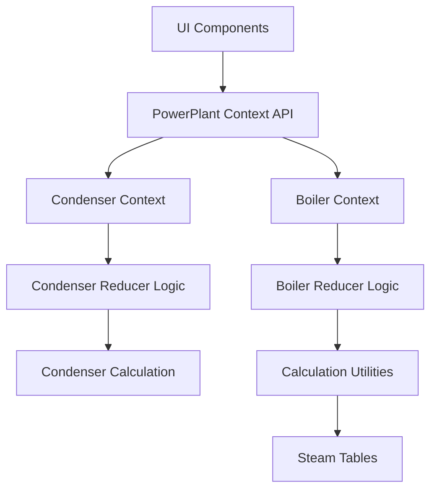
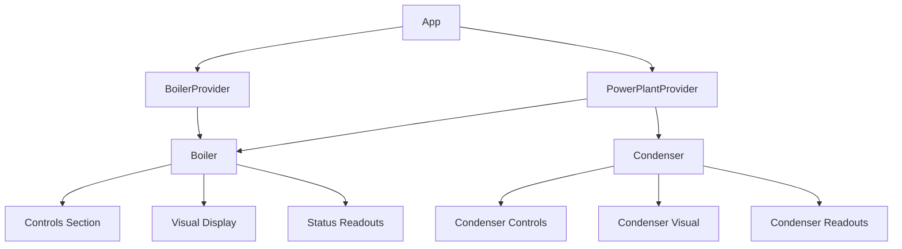
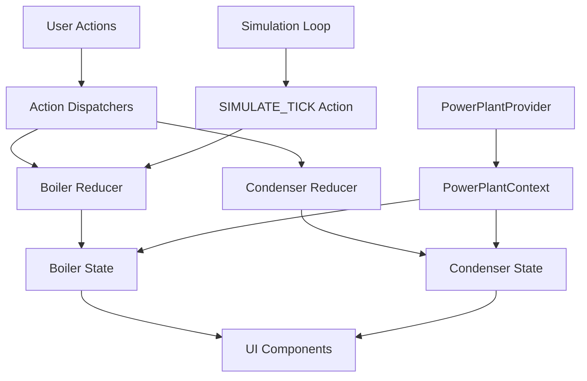
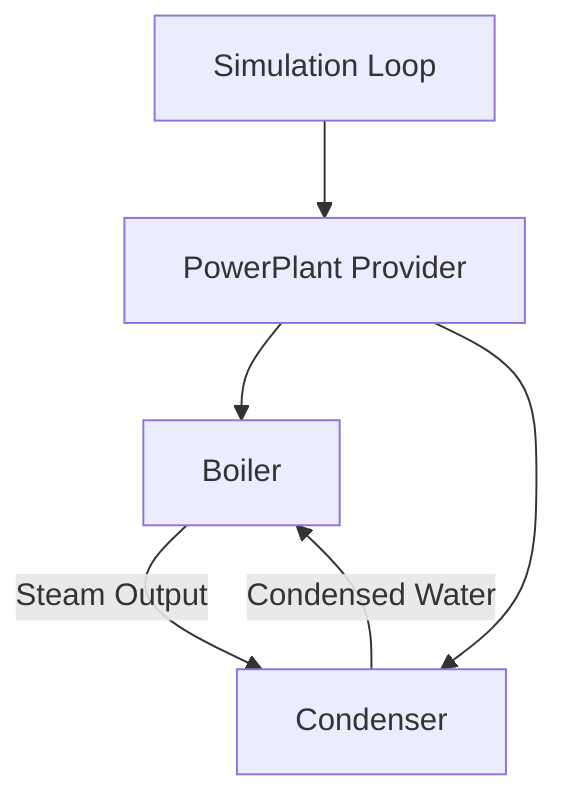

# System Patterns

## Architecture Overview

The Steam Boiler Simulation is built using a React application with a clear separation of concerns. The architecture follows these key patterns:



The PowerPlant architecture integrates both the Boiler and Condenser components into a cohesive system:

1. **PowerPlantProvider**: Top-level provider that manages the overall power plant state
2. **PowerPlantContext**: Provides access to both boiler and condenser states
3. **Boiler Components**: Handle steam generation
4. **Condenser Components**: Handle steam condensation back to water

## Core Design Patterns

### Context-Reducer Pattern

The application uses React's Context API combined with the Reducer pattern to manage state and simulation logic:

1. **PowerPlantContext**: Top-level context that provides access to the entire power plant state
2. **PowerPlantProvider**: Sets up the simulation loop and connects the reducers to their contexts

For the Boiler subsystem:
1. **BoilerReducer**: Contains the core boiler simulation logic and state transitions
2. **BoilerTick**: Handles time-based updates for the boiler

For the Condenser subsystem:
1. **CondenserReducer**: Contains the condenser simulation logic and state transitions
2. **CondenserTick**: Handles time-based updates for the condenser
3. **CondenserTypes**: Defines the state and action types for the condenser
4. **CondenserCalculation**: Contains utility functions for condenser-related calculations

This pattern offers several benefits:
- Centralized state management
- Clear separation between UI and simulation logic
- Predictable state transitions through actions
- Easy access to state from any component in the tree

### Simulation Loop

The simulation uses a time-based loop implemented with `useEffect` and `setInterval`:

```javascript
useEffect(() => {
  let lastTime = Date.now()

  const simulationInterval = setInterval(() => {
    const now = Date.now()
    const deltaTime = (now - lastTime) / 1000 // Convert to seconds
    lastTime = now

    dispatch({ type: "SIMULATE_TICK", deltaTime })
  }, 100) // Update 10 times per second

  return () => {
    clearInterval(simulationInterval)
  }
}, [])
```

This pattern:
- Ensures consistent simulation updates (10 times per second)
- Accounts for actual elapsed time between updates
- Properly cleans up when the component unmounts

### Energy Balance Approach

The simulation uses an energy balance approach to model the thermodynamic system:

For the Boiler:
```
Energy Change = Energy Input (gas) - Energy Output (cooling, steam generation, draining)
```

For the Condenser:
```
Energy Change = Energy Input (steam) - Energy Output (cooling, condensation)
```

The condenser implements a detailed energy balance calculation for steam condensation:

1. **Cold Water Energy Absorption**:
   ```typescript
   // Calculate energy absorbed by cold water (Q = m * cp * ΔT)
   const energyAbsorbed = massFlowRate * CstPhysics.Water_SpecificHeat * deltaT * CstSimulation.DeltaTime
   ```

2. **Steam Condensation Calculation**:
   ```typescript
   // Calculate mass of steam condensed (m = Q / latentHeat)
   const latentHeat = getLatentHeat(outletTemperature)
   const massCondensed = energyAbsorbed / latentHeat
   ```

3. **Volume Conversion**:
   ```typescript
   // Convert condensed mass to volume using water density
   const waterDensity = CstPhysics.Water_Density // kg/m³
   const volumeCondensed = (massCondensed / waterDensity) * 1000 // Convert m³ to liters
   ```

4. **Temperature Calculation**:
   ```typescript
   // Calculate temperature change based on energy balance
   const condensationEnergy = massCondensed * latentHeat
   const coolingEffect = massFlowRate * CstPhysics.Water_SpecificHeat * 
                         (outletTemperature - coldWaterIntakeTemperature)
   
   // Temperature rises due to condensation and falls due to cooling water
   const temperatureChange = (condensationEnergy - coolingEffect) / 
                            (newLiquidVolume * waterDensity / 1000 * CstPhysics.Water_SpecificHeat)
   ```

### Condenser Vacuum Control

The condenser implements a dual vacuum control system:

1. **Air Extraction Pump (CAR)**: Creates a base level vacuum
   ```
   if (isAirExtractionPumpEnabled) {
     // Gradually increase vacuum up to CAR_MaxVacuum
     newVacuum = Math.max(CAR_MaxVacuum, pressure - vacuumIncreaseRate * deltaTime)
   }
   ```

2. **Steam Jet Air Extraction (SJAE)**: Enhances vacuum beyond CAR capabilities
   ```
   if (isSjaeEnabled && boilerSteamFlow > 0 && pressure <= minVacuumNeeded) {
     // Calculate vacuum increase based on steam flow and valve position
     const valveEffect = sjaeValvePosition / 100
     const steamFlowEffect = Math.min(1, boilerSteamFlow / MaxSteamRemovalRate)
     const vacuumIncreaseRate = SJAE_VacuumIncreaseRate * valveEffect * steamFlowEffect
     
     // Apply vacuum increase
     newPressure = Math.min(CAR_MaxVacuum, pressure - vacuumIncreaseRate * deltaTime)
   }
   ```

3. **Vacuum Decay**: Models natural loss of vacuum when pumps are disabled
   ```
   if (!isSjaeEnabled && !isAirExtractionPumpEnabled) {
     // Decay to atmospheric pressure
     pressureAfterDecay = Math.min(AtmosphericPressure, pressure + VacuumDecayRate * deltaTime)
   }
   ```

This pattern:
- Models realistic vacuum behavior in industrial condensers
- Creates dependencies between systems (SJAE requires steam flow)
- Implements automatic safety controls (SJAE disables when pressure is too high)
- Provides multiple control points for the user

This pattern:
- Ensures conservation of energy in the system
- Provides a physically accurate basis for temperature and phase changes
- Allows for realistic modeling of multiple energy flows
- Creates a closed loop system where steam from the boiler is condensed back to water

## Component Relationships

### Data Flow



### State Management



### PowerPlant Integration

The PowerPlant integrates the Boiler and Condenser subsystems:



This integration:
- Creates a closed thermodynamic cycle
- Allows for realistic simulation of a complete power generation system
- Centralizes the simulation loop in the PowerPlantProvider
- Enables communication between the Boiler and Condenser subsystems

## Key Technical Decisions

### Condenser Pressure Calculation

The condenser pressure calculation follows a multi-step process:

1. **CAR Pressure Calculation**: Calculates pressure based on the Air Extraction Pump status
2. **SJAE Pressure Calculation**: Further reduces pressure if the Steam Jet Air Extraction is enabled
3. **Vacuum Decay**: Applies natural vacuum decay when pumps are disabled
4. **Pressure Validation**: Ensures pressure stays within realistic bounds

The implementation includes several key features:
- **Automatic SJAE Disabling**: SJAE is automatically disabled when:
  - There is no steam flow from the boiler
  - The pressure is above a threshold relative to the CAR maximum vacuum
- **Valve Position Effect**: The SJAE valve position affects the vacuum increase rate
- **Steam Flow Dependency**: The SJAE effectiveness is proportional to the available steam flow

### Steam Table Implementation

The simulation uses a data-driven approach with steam tables to ensure accurate thermodynamic properties:

- **Interpolation**: Properties between data points are calculated using linear interpolation
- **Extrapolation**: For values outside the table range, appropriate extrapolation methods are used
- **Temperature-Dependent Properties**: Water density, specific heat, and latent heat vary with temperature

### Pressure Calculation

Pressure is calculated based on:
- Steam mass accumulated in the system
- Temperature (which affects specific volume of steam)
- Available volume (total volume minus water volume)
- Saturation pressure at the current temperature

The implementation includes damping factors to model real steam behavior and prevent numerical instabilities.

### Boiling Point Determination

The boiling point is determined using different methods depending on the pressure range:
- For pressures within the steam table range: Interpolation between data points
- For pressures below the range: Antoine equation
- For pressures above the range: Power law extrapolation

## Simulation Simplifications

Several simplifications are made to balance accuracy with performance:

1. **Water Property Approximations**: Linear approximations for temperatures below 80°C
2. **Steam Volume Calculation**: Temperature-dependent expansion factors
3. **Pressure Calculation**: Damping factors for gradual pressure changes
4. **Fixed Constants**: For gas energy density, burner efficiency, cooling rate, etc.
5. **Condenser Vacuum Behavior**: Simplified vacuum creation and decay rates
6. **Intake Flow Rate Calculation**: Simplified model based on pressure ranges:
   ```javascript
   // Calculate pressure efficiency factor (0-1)
   let pressureEfficiency = 0
   if (condenserPressure < optimalPressureMin) {
     // Below optimal range - efficiency decreases as pressure gets too low
     pressureEfficiency = Math.max(0, condenserPressure / optimalPressureMin)
   } else if (condenserPressure <= optimalPressureMax) {
     // Within optimal range - full efficiency
     pressureEfficiency = 1
   } else {
     // Above optimal range - efficiency decreases as pressure increases
     const deltaPressureFactor = 1 / (condenserPressure - optimalPressureMax) / 10
     pressureEfficiency = Math.max(0, deltaPressureFactor)
   }
   ```

These simplifications maintain physical realism while ensuring the simulation runs smoothly in a browser environment.
